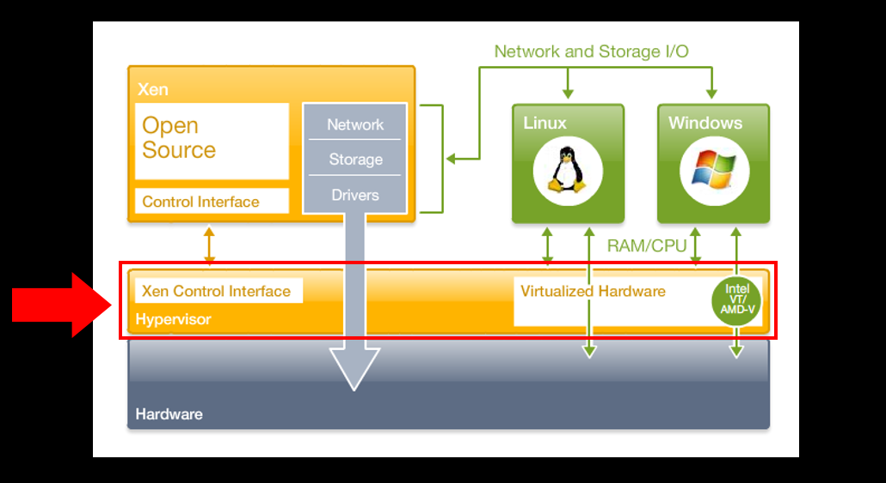
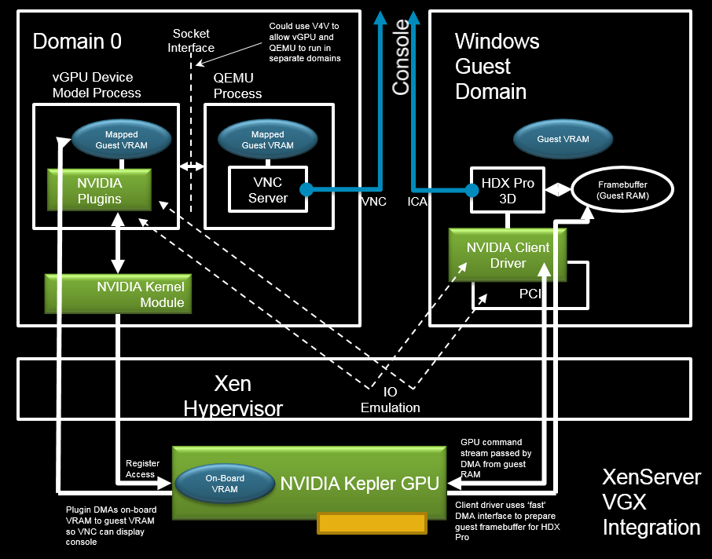
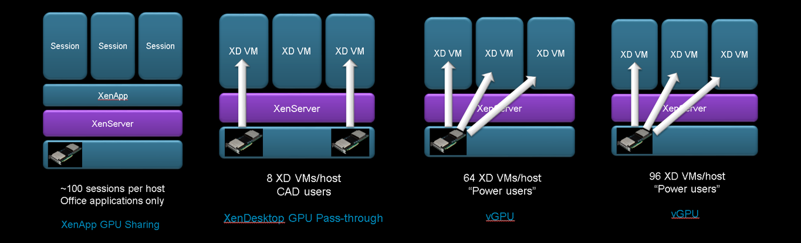

# xen-server

XenServer is an enterprise-class, cloud-proven, virtualization platform that delivers all of the critical features needed for any server and datacenter virtualization implementation.

XenServer是知名Citrix公司所推出的一款伺服器虛擬化平台，打從2013年6月左右，便加入了開放原始碼的行列，其核心基礎為Xen Project Hypervisor，這項裸機虛擬化技術提供了可運行在Intel與AMD x86硬體平台上的虛擬機器，有效徹底發揮接近於原生應用系統效能的作業程序，讓廣泛的Linux與Windows作業系統，能夠相容於它的虛擬作業環境並擁有如同在實體電腦主機的效能表現。

在如今私有雲端基礎虛擬化平台上的大量虛擬機器部署需求下，XenServer對於每一部系統的運行，在虛擬化硬體資源的配置支援上，首先在邏輯處理器支援部分就高達了160個，每一個Guest OS可以配置最多32個虛擬處理器(vCPU)，當然實際的配額量還得依照作業系統的版本支援來決定。網路部分則是支援了最多16個網路卡的連線，每一個虛擬機器可以配置最多7個網路介面，虛擬磁碟部分可以建立至多16個(包括虛擬DVD-ROM裝置)。而針對每一個Guest OS的記憶體支援則是最多192GB。

XenServer提供了Windows桌面專用的VM圖形管理工具、控制網域(dom0)、建立多樣化的虛擬機器範本功能、支援廣泛的儲存裝置整合功能、進階高效能的Tapdisk3儲存技術、支援透過Open Virtual Switch來建立軟體定義網路(SDN)、vGPU功能、以資源集區管理機制簡化從主機、儲存設備到網路資源的配置管理、提供企業等級的服務支援。

XenCenter是XenServer在Windows下的主要圖形管理主控台，您可以透過它來部署各類的虛擬機器、資源集區管理、儲存區配置、安全性管理以及高可用架構的建置等等。

一旦所建置的XenServer有兩部以上時，便可以部署較為複雜的高可用性架構，讓重要虛擬機器的運行可以得到持續的保護。而當虛擬機器數量越來越多時，則可以根據不同虛擬機器的屬性來規劃資源集區 (Resource Pool)，讓資源的配置管理不再是一個令IT頭痛的問題。

XenServer Resource Pool 的想法是將一群的XenServer 主機群視作一個單一的資源，存放在 shared storage中的Virtual Machines (VMs)可在資源池中的主機開啟，並可使用XenMotion移動到任一台主機，可動態調整虛擬主機運行位置，更有效率的使用整體系統資源；當HA (High Availability) 功能開啟時，如有一台主機失效，VM會自動的移到其他主機。

Resource Pool 有以下特點：

* 必須有一台主機擔任「Pool Master」角色。
* 同一個Pool的伺服器CPU廠牌、型號、功能須相同。例如同為 Intel 或 AMD 的廠牌、AMD-V與Intel VT 不能混合等。 
* XenServer 必須安裝相同的版本與更新(Hotfix)。
* 當Pool Master 主機失效(無法連接)時，需另外指派其他成員成為Pool Master，否則將無法連接到該pool。

## Compare to KVM

其實KVM與Xen很類似，都是建立在修改Linux Kernel之上（但是KVM算是Linux Kernel內建功能），也都利用QEMU做為虛擬機執行平台，較新的Linux Kernel都內建支援Xen與KVM。

Xen Hypervisor是圖中箭頭所指的地方，這裡提供了控制介面和虛擬硬體，它和Dom0需相互搭配，以便管理整臺實體主機和VM的資源。在XenServer所搭配的Xen是4.4版。

圖中是XenServer的vGPU支援架構與彼此的細部運作方式，主要分為三大部分，最底層是Nvidia GPU，中間是Xen Hypervisor，上層是dorm0和Windows VM，需要安裝Nvidia的核心模組、外掛，以及用戶端驅動程式。

XenServer 6.2支援了3種GPU虛擬化方式，由左而右，分別是GPU Sharing、GPU Pass-through、vGPU。6.5版支援的vGPU程度更高，可支撐高達96臺應用vGPU的VM。